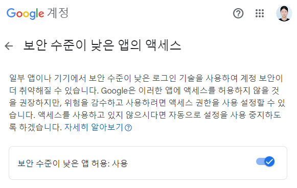
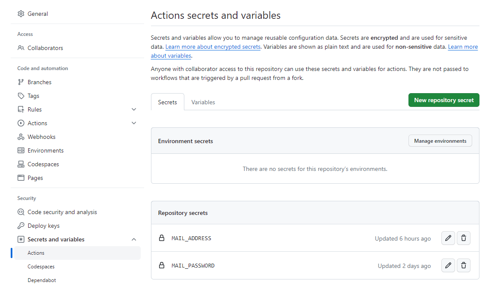
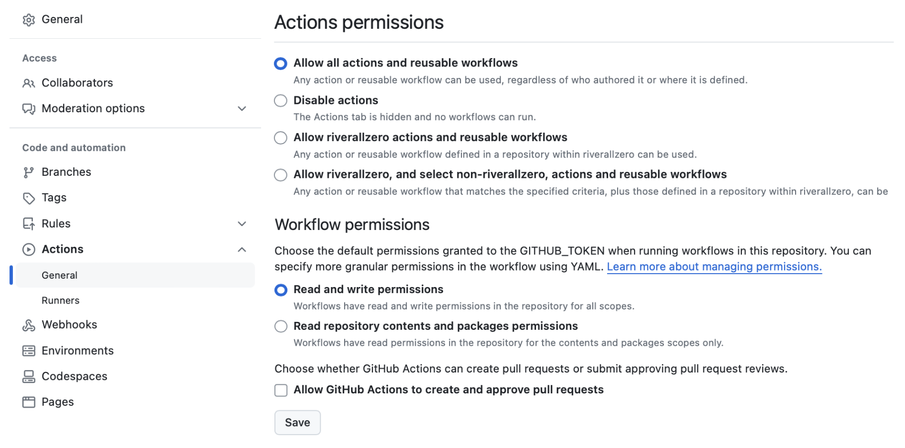
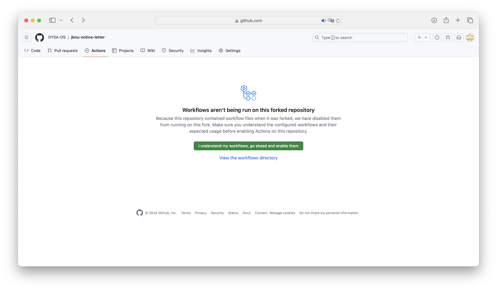
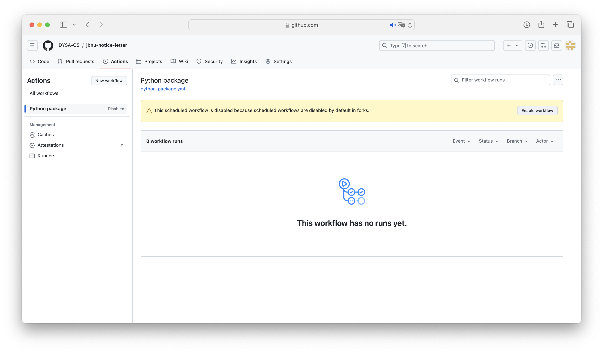
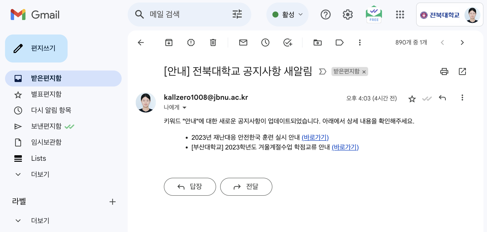

# 전북대학교 공지사항 뉴스레터
- 2023년도 2학기 스마트농업프로그래밍(모니터링 서비스)
- 개요: 전북대학교 웹사이트 공지사항에서 원하는 키워드가 포함된 글이 올라올 때 메일로 관련 정보를 받아볼 수 있습니다. 작업은 평일 10 ~ 18시 2시간 간격으로 실행되며, 아래 매뉴얼은 `@jbnu.ac.kr`을 사용하는 경우입니다.

## How To Use  
### 0. Fork
### 1. GMail: ~@jbnu.ac.kr

[보안 수준이 낮은 앱의 액세스](https://myaccount.google.com/lesssecureapps?pli=1&rapt=AEjHL4PZOeH6jzDHnTrdcpZ50qdFHgN6WEJmb5muJvWQP3DuLHQx5-M0abBYO6Jy1kx119Iu_cjOYxHbYej7So53JyXUaw29CQ) &rarr; 앱 허용: 사용으로 설정합니다.



### 2. Repository
- Settings > (Security) Secrets and variables > Actions > ```New repository secret```
- Name이 'MAIL_ADDRESS', 'MAIL_PASSWORD'인 변수 생성
  - MAIL_ADDRESS(변수 이름): 메일 주소(변수 값)
  - MAIL_PASSWORD(변수 이름): 메일 비밀번호(변수 값)
  


- Settings > (Code and automation) Actions > General > Workflow permissions > ```Read and write permissions```




### 3. Custom Keywords
- crawler.py: line 11에 원하는 키워드 입력 (예. ['벨트'], ['연수', '특강'] 등)

  ```python
  keywords = ['안내']
  ```
  
### 4. Activate Actions
Actions > ```I understand my workflows, go ahead and enable them``` > Python package > ```Enable workflow```



## Result

